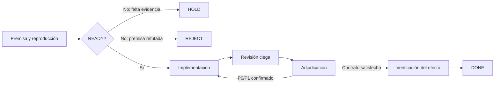

# SUPER guare

[](https://github.com/cervantesh/super-guare/actions/workflows/ci.yml)
[](LICENSE)

Un skill de Codex para coordinar cambios técnicos de alto riesgo con evidencia,
implementación delegada, revisión independiente y una adjudicación final
auditable.

SUPER guare está pensado para situaciones donde un resultado verde superficial
no basta: concurrencia, persistencia, migraciones, permisos, recuperación,
seguridad o una premisa técnica disputada. Su objetivo no es añadir ceremonia,
sino impedir que una hipótesis plausible termine presentada como una solución
verificada.

## La idea central

El **SUPER** dirige la investigación y adjudica los resultados, pero no escribe
la implementación. Los **guares** trabajan con responsabilidades separadas:

- **Reconocimiento:** demuestra el síntoma, el entrypoint real y el límite
  causal.
- **Adversario técnico:** intenta falsificar la premisa o el diseño cuando el
  riesgo lo justifica.
- **Implementador:** construye únicamente el alcance adjudicado y sus pruebas.
- **Revisor ciego:** evalúa el contrato, el diff y la evidencia sin depender de
  la explicación del implementador.

Esta separación reduce el riesgo de que quien diseñó o escribió el arreglo
también sea la única persona que decida si funciona.



## Qué exige

- Reproducir el problema contra un árbol y un SHA concretos.
- Distinguir hechos observados, inferencias y decisiones.
- Definir un predicado de cierre observable antes de implementar.
- Separar el arreglo estricto de hardening o arquitectura futura.
- Buscar primero owners, PRs o soluciones que ya cubran el mismo contrato.
- Proponer el arreglo completo de menor footprint, no necesariamente el de
  menos líneas.
- Usar TDD y atravesar el entrypoint real cuando sea posible.
- Revisar el diff congelado con un agente distinto del implementador.
- Verificar el efecto final, no sólo el código o el exit code de una prueba.

## Cuándo usarlo

Úsalo cuando un defecto pueda ser costoso, silencioso o difícil de revertir, o
cuando varias interpretaciones razonables compitan por el diagnóstico.

No suele compensar para:

- cambios pequeños y mecánicos con una reproducción directa;
- documentación sin impacto contractual;
- tareas de sólo lectura que no cruzan sesiones ni roles;
- modificaciones donde una prueba enfocada ya demuestra completamente el
  efecto y el control negativo.

El riesgo aumenta la profundidad de la evidencia, no el tamaño de la solución.

## Instalación

### Windows PowerShell

```powershell
$codexHome = if ($env:CODEX_HOME) { $env:CODEX_HOME } `
  else { Join-Path $env:USERPROFILE ".codex" }
New-Item -ItemType Directory -Force (Join-Path $codexHome "skills") | Out-Null
git clone https://github.com/cervantesh/super-guare.git `
  (Join-Path $codexHome "skills\super-guare")
```

### Linux y macOS

```bash
mkdir -p "${CODEX_HOME:-$HOME/.codex}/skills"
git clone https://github.com/cervantesh/super-guare.git \
  "${CODEX_HOME:-$HOME/.codex}/skills/super-guare"
```

Reinicia Codex después de instalarlo. Puedes invocarlo explícitamente con:

```text
$super-guare investiga y corrige este fallo usando TDD
```

Codex también puede seleccionarlo automáticamente cuando el riesgo y la
complejidad encajan con su descripción.

## Ledger durable opcional

Cuando el trabajo cruza sesiones, agentes, motores o worktrees, el repositorio
incluye un ledger de estado portable y basado únicamente en la biblioteca
estándar de Python:

```text
premise → ready → implement → review → adjudicate → verify → done
```

El ledger fija el contrato por SHA-256, registra el head revisado, conserva la
identidad de los defectos y rechaza estados ambiguos o contradictorios. No
sustituye la evidencia técnica ni lanza agentes; evita que el proceso declare
una transición que sus propios datos no sostienen.

Ejemplo mínimo:

```bash
python scripts/runledger.py --dir .super-guare/runs --run SG-001 \
  init --title "Corregir persistencia" --repo owner/repo \
  --base <base-sha> --head <head-sha>

python scripts/runledger.py --dir .super-guare/runs --run SG-001 \
  pin-contract --file contrato.md

python scripts/runledger.py --dir .super-guare/runs --run SG-001 show
```

Consulta [la guía del ledger](references/durable-ledger.md) para el flujo
completo, los checks ternarios, los roles y la resolución de findings.

## Estructura del repositorio

```text
super-guare/
├── SKILL.md                         Playbook principal cargado por Codex
├── scripts/runledger.py             Ledger durable opcional
├── tests/test_runledger.py          Pruebas de invariantes y corrupción
├── references/durable-ledger.md     Guía operativa del ledger
├── references/behavioral-calibration.md
│                                     Calibración offline del playbook
└── LICENSE                          Licencia MIT
```

## Desarrollo y validación

El proyecto no requiere dependencias de ejecución externas. Para validar el
ledger:

```bash
python -X utf8 -m unittest discover -s tests -v
python -X utf8 -m py_compile scripts/runledger.py
```

El CI ejecuta la suite en Ubuntu y Windows. `main` está protegido y requiere
ambos checks antes de fusionar cambios.

## Principios de diseño

1. **La premisa se demuestra.** Un issue o una propuesta son hipótesis, no
   autoridad.
2. **El alcance es quirúrgico.** El cierre estricto no absorbe hardening futuro.
3. **Menor footprint no significa menos líneas.** Importan la superficie y el
   acoplamiento permanentes.
4. **La revisión busca falsificar.** Una segunda opinión sólo aporta si puede
   encontrar razones concretas para decir `no-ok`.
5. **El efecto manda.** Ningún voto, mock verde o comando exitoso reemplaza la
   consecuencia observable prometida.
6. **La incertidumbre falla cerrada.** `no pude mirar` y `undetermined` nunca se
   redondean a éxito.

Las instrucciones normativas viven en [SKILL.md](SKILL.md). Este README es una
introducción para personas y no reemplaza ese contrato operativo.

## Influencias

El ledger adopta ideas públicas de
[T50-Systems/lider](https://github.com/T50-Systems/lider), como el estado durable,
los checks ternarios, la identidad estable de findings y la detección de drift.
SUPER guare adapta esos conceptos a su propio flujo; no copia ni sustituye el
runtime de Lider.

## Licencia

[MIT](LICENSE)
